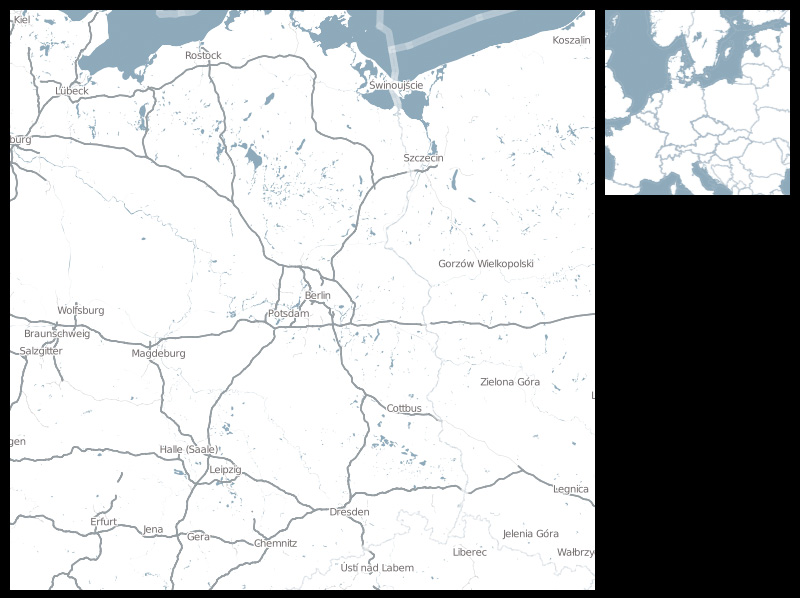



Creates random markers, and checks whether they are in vicinity to each other.
If they are neighbors a connection is shown.

###### in **examples/marker/connectionmarker/NeighborMarkersApp.java*c 

	public class NeighborMarkersApp extends PApplet {
	
		UnfoldingMap map;
	
		public void setup() {
			size(800, 600, GLConstants.GLGRAPHICS);
	
			map = new UnfoldingMap(this);
			map.zoomToLevel(11);
			map.panTo(new Location(52.53f, 13.4f));
			MapUtils.createDefaultEventDispatcher(this, map);
	
			// Create Markers from random Locations
			List<Marker> markers = new ArrayList<Marker>();
			List<Marker> connectionMarkers = new ArrayList<Marker>();
			
			for (int i = 0; i < 30; i++) {
				DotMarker m = new DotMarker(new Location(random(52.463f, 52.608f), random(13.23f, 13.54f)));
				markers.add(m);
			}
	
			// Create connections between near-by markers
			for (Marker marker : markers) {
				for (Marker markerTo : markers) {
					// Less than 3 km
					if (GeoUtils.getDistance(marker.getLocation(), markerTo.getLocation()) < 3) {
						ConnectionMarker cm = new ConnectionMarker(marker, markerTo);
						connectionMarkers.add(cm);
					}
				}
			}
	
			// Add Markers to the maps default MarkerManager
			map.addMarkers(markers);
			map.addMarkers(connectionMarkers);
		}
	
		public void draw() {
			background(240);
	
			// Drawing Markers in handled internally
			map.draw();
		}
	
	}

Have a look at the other [Marker examples](https://github.com/tillnagel/unfolding/tree/develop/examples/de/fhpotsdam/unfolding/examples/marker).
