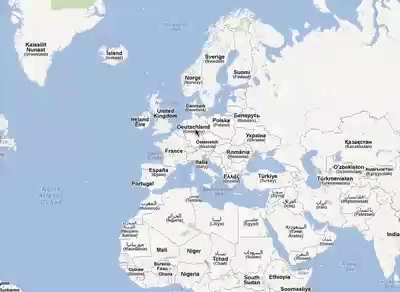



## Map tiles

Unfolding maps are based on pre-rendered map tiles. Each tile is a small image, and contains the topographic information of a rectangular map area as pixel-based graphic. 

Each tile consists of 256 × 256 pixels. This tile-based approach is done to manage maps at higher zoom levels. Otherwise, a single image showing the entire earth would be too large, e.g. for a zoom level of 10 it would consist of 131.072 × 131.072 pixels.

By using tiles you easily can develop interactive maps. On top of the basis map you can draw markers, vectors, diagrams, user interface elements, and everything else.

<!--
"A *slippy map* is type of web-browser based map client that allows you to dynamically pan the map simply by grabbing and sliding the map image in any direction. Modern web browsers allow dynamic loading of map tiles in response to user action without requiring a page reload. This dynamic effect makes map viewing more intuitive." (John Frank, MetaCarta)
-->

## Map styles

Unfolding displays maps in a default style, with cartographic data from OpenStreetMaps and tiles from CloudMade. To use another map style, simply specify it as second parameter when constructing an `UnfoldingMap`. This way, you can easily switch to one of the pre-configured map tile providers.

For instance if you want to display a satellite map use the Microsoft Aerial Provider:

	UnfoldingMap map;

	void setup() {
	  size(800, 600, GLConstants.GLGRAPHICS);
	  map = new UnfoldingMap(this, new Microsoft.AerialProvider());
	  MapUtils.createDefaultEventDispatcher(this, map);
	}

	void draw() {
	  map.draw();
	}

### Various map providers

Unfolding comes with a couple of pre-configured map providers.

Keep in mind you need to check the terms and conditions of the map providers on how you are allowed to use their map tiles. We are providing the example providers for educational purposes, only. (Some come with a "CC-BY-SA 2.0" license, some with more restricted licenses.)

The following are some of the map providers included in the Unfolding distribution:

- OpenStreetMap.OpenStreetMapProvider();   
- OpenStreetMap.CloudmadeProvider(API KEY, STYLE ID);
- Stamen.TonerProvider(); 
- Google.GoogleMapProvider();   
- Google.GoogleTerrainProvider();   
- Microsoft.RoadProvider();   
- Microsoft.AerialProvider();   
- Yahoo.RoadProvider();   
- Yahoo.HybridProvider();   

Check the [MapProvider package API](/javadoc/index.html?de/fhpotsdam/unfolding/providers/package-summary.html) for more styles.

### Create own map provider

You can also create your own `MapProvider` in order to load and use other map tiles.

For that you need to know the URLs to access the tiles, and extend an appropriate MapProvider with a similar request mechanism. Take a look at the `StamenMapProvider` to see how to extend the OpenStreetMapProvider.

(More to come soon.)

## Create your own map style
If you want to create a completely new map style you can use different methods.

For simple adaptations you could use the [CloudMade style editor](http://developers.cloudmade.com/projects/show/style-editor) and specify its ID in the `CloudmadeProvider`.

For more options you can create a map with [TileMill](http://tilemill.com/). See the article [TileMill for Processing](http://tillnagel.com/2011/06/tilemill-for-processing/) for a brief introduction on how to create maps with TileMill. After you exported your styled map to a MBTiles file (a database containing the tiles), you can use it with Unfolding.
For this, you need to add the [SQLlite driver](http://code.google.com/p/sqlite-jdbc/) to your Processing libraries (included in the Eclipse template). Then, specify the path to the MBTiles file in the `MBTilesMapProvider`.

	UnfoldingMap map;

	void setup() {
	  size(800, 600, GLConstants.GLGRAPHICS);

	  String connStr = "jdbc:sqlite:" + sketchPath("data/myMapStyle.mbtiles");
	  map = new UnfoldingMap(this, new MBTilesMapProvider(connStr));
	  MapUtils.createDefaultEventDispatcher(this, map);
	  map.setZoomRange(2, 4);
	}

	void draw() {
	  map.draw();
	}

In Processing you need to specify the absolute file path. In line 6 above, we use Processing's `sketchPath()` method to access the MBTiles file. In Eclipse you should put that database file into your data folder, and reference it relatively.

	String connStr = "jdbc:sqlite:jdbc:sqlite:../data/myMapStyle.mbtiles");
	

	
## Switch map provider dynamically

There are two ways to switch between two or more styles dynamically.

1. Switch between maps
2. Switch provider of a single map 

### Switch between maps

In the following example, we create three maps with different map styles, but draw only the currentMap.
All maps listen to map events themselves, i.e. all interactions affect each map, resulting in the same region.

	UnfoldingMap currentMap;
	UnfoldingMap map1;
	UnfoldingMap map2;
	UnfoldingMap map3;

	void setup() {
		size(800, 600, GLConstants.GLGRAPHICS);

		map1 = new UnfoldingMap(this, new Google.GoogleMapProvider());
		map2 = new UnfoldingMap(this, new Microsoft.AerialProvider());
		map3 = new UnfoldingMap(this, new OpenStreetMap.CloudmadeProvider(MapDisplayFactory.OSM_API_KEY, 23058));
		MapUtils.createDefaultEventDispatcher(this, map1, map2, map3);

		currentMap = map1;
	}

	void draw() {
		currentMap.draw();
	}

	void keyPressed() {
		if (key == '1') {
			currentMap = map1;
		} else if (key == '2') {
			currentMap = map2;
		} else if (key == '3') {
			currentMap = map3;
		}
	}

Only one map at a time is displayed, and only the tiles of that one will be loaded. Yet, after tiles are loaded switching maps is faster than switching providers. It takes more memory though. 

### Switch between providers

This option enables switching between different tile providers for the same map. All map settings are persistent, i.e. current transformations, markers, interactions, etc will stay the same.

	UnfoldingMap map;
	AbstractMapProvider provider1;
	AbstractMapProvider provider2;
	AbstractMapProvider provider3;

	void setup() {
		size(800, 600, GLConstants.GLGRAPHICS);

		provider1 = new Google.GoogleMapProvider();
		provider2 = new Microsoft.AerialProvider();
		provider3 = new OpenStreetMap.CloudmadeProvider(MapDisplayFactory.OSM_API_KEY, 23058);

		map = new UnfoldingMap(this, provider1);
		MapUtils.createDefaultEventDispatcher(this, map);
	}

	void draw() {
		map.draw();
	}

	void keyPressed() {
		if (key == '1') {
			map.mapDisplay.setProvider(provider1);
		} else if (key == '2') {
			map.mapDisplay.setProvider(provider2);
		} else if (key == '3') {
			map.mapDisplay.setProvider(provider3);
		}
	}

After switching the tile cache will be cleared and visible tiles loaded from new provider. Thus, it always holds only one tile set, and consumes less memory, but takes a bit longer to load.

