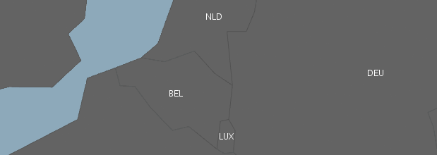
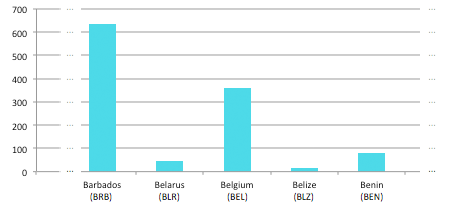
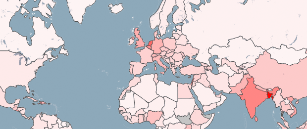



## Combine geo-spatial data with other data sources

When you have data from multiple sources, you need to load and combine them via some ID or other unique value in both data sets.

As an example, let's combine geometry data with population density data.
The country shapes are loaded from a GeoJSON file via a data reader, while the population density values come from an external CSV file.

The GeoJSON includes:

	{"type":"Feature","id":"BEL","properties":{"name":"Belgium"},"geometry":{"type":"Polygon","coordinates":[[[3.314971,51.345781],[4.047071,51.267259], ...]]}}

The CSV file includes:

	Belgium;BEL;359.8414795

(Note the *BEL* for Belgium as ID in GeoJSON and as second value in the CSV. This is the three-letter [country code](http://en.wikipedia.org/wiki/Country_code).)
  
First we load all country polygons as markers, then all data from the CSV into a hashmap with country codes as keys.

	List<Marker> countryMarkers;
	HashMap<String, DataEntry> dataEntriesMap;

	public void setup() {
		size(800, 600, GLConstants.GLGRAPHICS);
		map = new UnfoldingMap(this);
		
		// Load country polygons and adds them as markers
		List<Feature> countries = GeoJSONReader.loadData(this, "countries.geo.json");
		countryMarkers = MapUtils.createSimpleMarkers(countries);
		map.addMarkers(countryMarkers);

		// Load population data
		dataEntriesMap = loadPopulationDensityFromCSV("population-density.csv");
	}
	
In order to find matching population values for each country, we use the country code existing in both files to lookup a CSV value for the current marker.

	for (Marker marker : countryMarkers) {
		// Find data for country of the current marker
		String countryId = marker.getId();
		DataEntry dataEntry = dataEntriesMap.get(countryId);

		// Encode value to transparency (value range: 0-700)
		float alpha = map(dataEntry.value, 0, 700, 10, 255);
		marker.setColor(color(255, 0, 0, alpha));
	}

This example visualizes population density of the world as a choropleth map. Countries are shaded in proportion to the population density. The data value is encoded to transparency via a simplistic linear mapping. 

See the [Choropleth Map](../examples/40_choropleth.html) example for the full code. 

## Read from other sources

You can also query geospatial data from other sources, such as databases, or web services.

Check out our [Geonames tutorial](geonames-lookup-basic.html) on finding geo-locations for place names.

## Other tutorials

Check out our other marker tutorials: [Marker introduction](markers-simple.html), and [Marker &amp; Data](markers-data-geojson.html).

