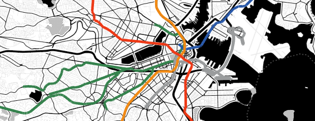



## Reading data files

The following example displays countries of the world as simple polygons. Reads from a GeoJSON file, and uses default marker creation, i.e. features are represented by simple markers in the default style.

	UnfoldingMap map;

	void setup() {
		size(800, 600);
	
		map = new UnfoldingMap(this);
		MapUtils.createDefaultEventDispatcher(this, map);
	
		List<Feature> countries = GeoJSONReader.loadData(this, "countries.geo.json");
		List<Marker> countryMarkers = MapUtils.createSimpleMarkers(countries);
		map.addMarkers(countryMarkers);
	}

	void draw() {
		map.draw();
	}

As easily you can load data from sources in other formats, for instance an online GeoRSS containing the latest earthquakes.

	String rssUrl = "http://earthquake.usgs.gov/earthquakes/feed/v1.0/summary/4.5_week.atom";
	List<Feature> features = GeoRSSReader.loadDataGeoRSS(this, rssUrl);
	List<Marker> markers = MapUtils.createSimpleMarkers(features);

The provided data readers **support basic functionality**, and do not fully implement the respective specifications. The GeoJSON parser supports most features, while the GeoRSS reader supports only Simple and W3C Geo, but not GML, and the GPX reader only enables reading track points. So, either use some other library to parse various data formats with full specification support, or tell us what file you are trying to read in our [issue tracker](https://github.com/tillnagel/unfolding/issues).

## Using Shapefiles

Various kinds of geo-data are freely available, and often provided as [Shapefile](http://en.wikipedia.org/wiki/Shapefile). These contain geometries such as points, lines, and polygons, and additional data attributes.

Unfolding does not provide parsing Shapefiles out-of-the-box. You can either use some library to parse those and convert them to Unfolding markers. See for instance [how to read Shapefiles in Java](http://stackoverflow.com/questions/2044876/does-anyone-know-of-a-library-in-java-that-can-parse-esri-shapefiles) by utilizing the [GeoTools library](http://geotools.org/).

Alternatively, you can convert a Shapefile to another format. One easy tool is the [OGR Simple Feature Library](http://www.gdal.org/ogr/) (part of [GDAL](http://www.gdal.org)). After installing it on your machine, you can simply convert geo-data from one format to another, e.g.:

	ogr2ogr -f geoJSON countries.json countries.shp

If you don't want to install that library, you can use the [ogr2ogr web client](http://ogre.adc4gis.com/).

For an example, let's use a Shapefile containing borders of all countries. Download the simplified version from [thematicmapping.org](http://thematicmapping.org/downloads/world_borders.php). Then, go to [ogr2ogr web client](http://ogre.adc4gis.com/), upload that zip file, and convert it to GeoJSON. Save the result as "countries-simple.geo.json" in the data folder of your Unfolding sketch. Now, you simply have to load and use the data to create markers.

	List<Feature> countries = GeoJSONReader.loadData(this, "countries-simple.geo.json");

## Features and Markers

A `Feature` ([API](/javadoc/index.html?de/fhpotsdam/unfolding/data/package-summary.html)) contains the geographic data such as a single location for a point, or multiple locations for lines or polygons, and optionally some data properties.	
A `Marker` ([API](/javadoc/index.html?de/fhpotsdam/unfolding/marker/package-summary.html)) is the visual representations of a feature on a map.

In the examples above, we create default markers automatically from the loaded geo data.
	
	List<Feature> features = GeoDataReader.loadData(this, dataFile);
	List<Marker> markers = MapUtils.createSimpleMarkers(features);

This way, Unfolding creates simple markers in the default style. If you want to change the display style, or have extended functionality you need to create the markers on your own. There are two ways of doing that:

### Specify which markers to create automatically

You can create other markers than the default ones from features. Specify an appropriate marker class, and create the markers from some already populated features.

	MarkerFactory markerFactory = new MarkerFactory();
	markerFactory.setPolygonClass(MyPolygonMarker.class);
	List<Marker> markers = markerFactory.createMarkers(features);
	map.addMarkers(markers);

See the [Markers tutorial](markers-simple.html) on how to create own marker classes. 

(More details coming soon.)

### Create markers from features manually

If you want to use an existing marker class, but set some visual properties based on data attributes, you can do that by creating the markers on your own.

In this example the transit lines in Boston are loaded from a GeoJSON file as features (line 4). Then, we check for the data attribute containing the name of the MBTA line (line 11). Lastly, we use that name to color code the line markers (lines 12-29), and add them to the map (line 34).

		List<Marker> transitMarkers = new ArrayList<Marker>();

		// Load features from GeoJSON
		List<Feature> transitLines = GeoJSONReader.loadData(this, "MBTARapidTransitLines.json");
		
		// Create markers from features, and use LINE property to color the markers.
		for (Feature feature : transitLines) {
			ShapeFeature lineFeature = (ShapeFeature) feature;

			SimpleLinesMarker m = new SimpleLinesMarker(lineFeature.getLocations());
			String lineColor = lineFeature.getStringProperty("LINE");
			int color = 0;
			// Original MBTA colors
			if (lineColor.equals("BLUE")) {
				color = color(44, 91, 167);
			}
			if (lineColor.equals("RED")) {
				color = color(233, 57, 35);
			}
			if (lineColor.equals("GREEN")) {
				color = color(59, 130, 79);
			}
			if (lineColor.equals("SILVER")) {
				color = color(154, 156, 157);
			}
			if (lineColor.equals("ORANGE")) {
				color = color(238, 137, 40);
			}
			m.setColor(color);
			m.setStrokeWeight(5);
			transitMarkers.add(m);
		}

		map.addMarkers(transitMarkers);

See the [MBTA Lines](/examples/40_marker-mbta-lines.html) example for the full code.

## Generalization & Level of detail

(As you can see, the simplified (i.e. [generalized](http://en.wikipedia.org/wiki/Cartographic_generalization)) border data results in overlaps and gaps between the vector countries and the underlying tiles. Use a high detailed data file to prevent this. For performance boosts, look at our examples AutoGeneralization or ZoomDependentPolygonData.)

